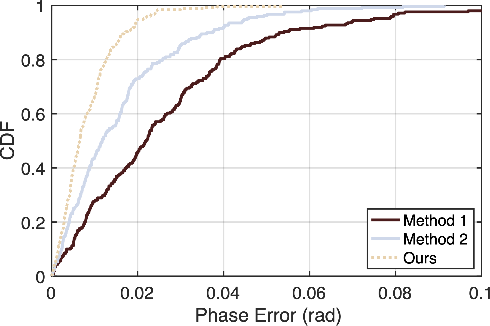

# Plot Gallery

  

    <a href="matlab-plot/#basic-settings-in-matlab">
      

        
      

    </a>
    
CDF Plot

  

  

    <a href="#section3">
      

        
      

    </a>
  

  

    <a href="matlab-plot/#heatmap">
      

        
      

    </a>
    
Heatmap

  

